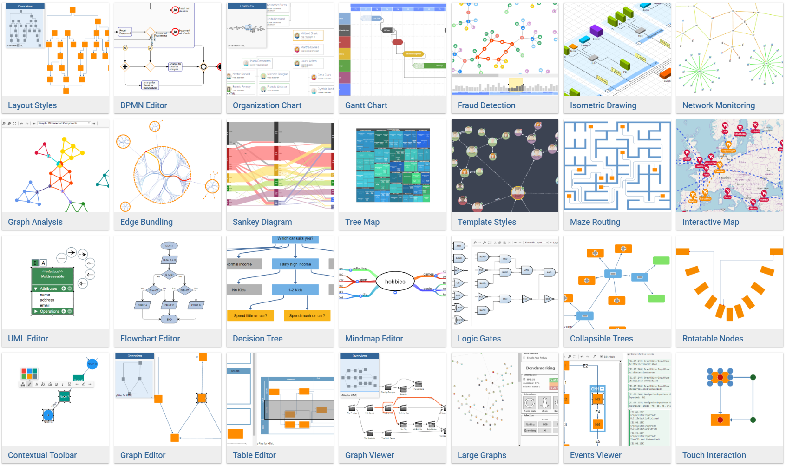

# yFiles.NET Demo Sources

This repository contains source code demos that use the commercial [yFiles.NET](https://www.yworks.com/products/yfiles-net) software programming library for the visualization of graphs, diagrams, and networks. The library itself is __*not*__ part of this repository.

# Running the Demos

For most of these demos equivalent ones based on [yFiles for HTML](https://www.yworks.com/yfileshtml)
are hosted [online here](https://live.yworks.com/yfiles-for-html) for everyone to play with. Developers should [evaluate the library](https://www.yworks.com/products/yfiles-net/evaluate), instead. 
The evaluation version also contains these demos and the necessary library to execute the code. 

# License

Use of the software hosted in this repository is subject to the license terms of the corresponding yFiles.NET license. 
Owners of a valid software license for a yFiles.NET version that these
demos are shipped with are allowed to use the demo source code as basis
for their own yFiles.NET-powered applications. Use of such programs is
governed by the rights and conditions as set out in the yFiles.NET
license agreement. More details [here](./LICENSE). If in doubt, feel free to [contact](https://www.yworks.com/contact) the yFiles.NET support team.
